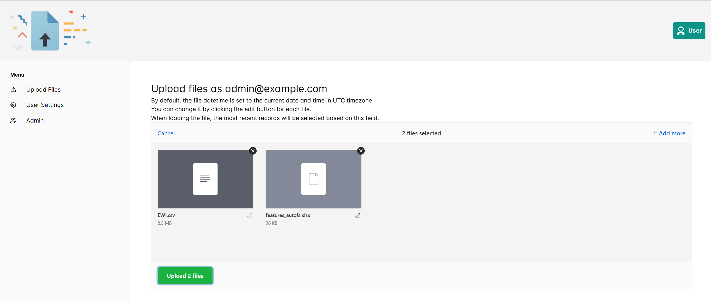

# Uppy Fastapi Uploader Demo

### Features:

- Frontend with typescript, admin dashboard and upload panel made with uppy.js.
- Backend with Python & Fastapi (#TODO: add cloud upload instead of local only)
- Docker compose deployment
- Uploaded files are saved with uuid filenames and user directories for security
- Only allowed extensions are accepted
- A timestamped directory is used for the file upload

### Demo instructions:

First, change the backend volume for uploads in (docker-compose.override.yml) from:
``- /home/leo/demo_uploader_dagster:/app/uploads`` to your intended local demo directory.

```sh
git clone https://github.com/leonardobocci/uppy-fastapi-uploader.git uploader
cd uploader
docker compose up -d
```

Now any uploaded files will land into the target local dir. \
They can be picked up by dagster sensors and processed further.

Forked from [Fastapi full stack template](https://github.com/fastapi/full-stack-fastapi-template). See that repo for details of repo structure.

